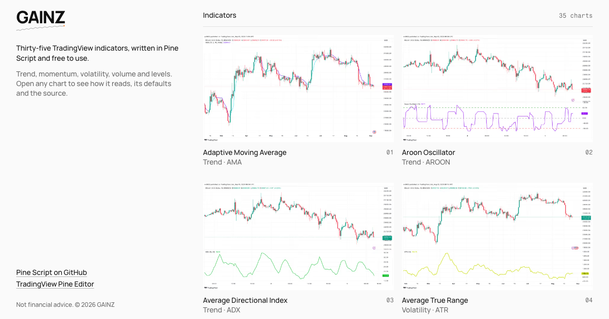

# GAINZ



35 open-source TradingView indicators, written in Pine Script and free to use: trend, momentum, volatility, volume and levels. Each one opens with its chart, how to read it, its default settings and a link to the source.

Live at [gainz-trading-indicators.vercel.app](https://gainz-trading-indicators.vercel.app).

## The scripts

The Pine Script lives in seven collections of five indicators each:

| Collection                                                            | Indicators                                                                                           |
| --------------------------------------------------------------------- | ---------------------------------------------------------------------------------------------------- |
| [v1](https://github.com/AkashSasikumar47/pine-strategy-indicators-v1) | EMA, RSI, SMA, Stochastic Oscillator, Trading Volume                                                 |
| [v2](https://github.com/AkashSasikumar47/pine-strategy-indicators-v2) | ATR, Bollinger Bands, CCI, MACD, Williams %R                                                         |
| [v3](https://github.com/AkashSasikumar47/pine-strategy-indicators-v3) | Aroon Oscillator, Fibonacci Retracement, On-Balance Volume, Parabolic SAR, Ichimoku Cloud            |
| [v4](https://github.com/AkashSasikumar47/pine-strategy-indicators-v4) | ADX, Chaikin Volatility, Keltner Channels, Relative Volatility Index, Volatility Ratio               |
| [v5](https://github.com/AkashSasikumar47/pine-strategy-indicators-v5) | Adaptive Moving Average, Chandelier Exit, Relative Momentum Index, Supertrend, Trend Strength Index  |
| [v6](https://github.com/AkashSasikumar47/pine-strategy-indicators-v6) | Awesome Oscillator, Cumulative Volume Index, Hull Moving Average, Moon Phases, Visible Average Price |
| [v7](https://github.com/AkashSasikumar47/pine-strategy-indicators-v7) | Balance of Power, McGinley Dynamic, Relative Vigor Index, Vortex Indicator, Woodies CCI              |

To use one, open its `.pine` file, paste it into the [Pine Editor](https://www.tradingview.com/pine/) on TradingView, save it and add it to your chart.

## Stack

Next.js 16, React 19, TypeScript 7, Tailwind CSS 4, shadcn/ui and Motion, on Node 24 with pnpm 12.

```bash
pnpm install
pnpm dev
```

Open [http://localhost:3000](http://localhost:3000).

| Command              | Does                            |
| -------------------- | ------------------------------- |
| `pnpm dev`           | Runs the site on localhost:3000 |
| `pnpm build`         | Builds for production           |
| `pnpm typecheck`     | Type-checks the app             |
| `pnpm format`        | Formats the repo with Prettier  |
| `pnpm ui:add <name>` | Adds a shadcn/ui component      |

Indicator content lives in `lib/indicators.ts` and the charts in `public/indicators`.

## Disclaimer

For learning and research. Indicators describe what price has done, not what it will do. Nothing here is financial advice.

## License

[MIT](./LICENSE)
